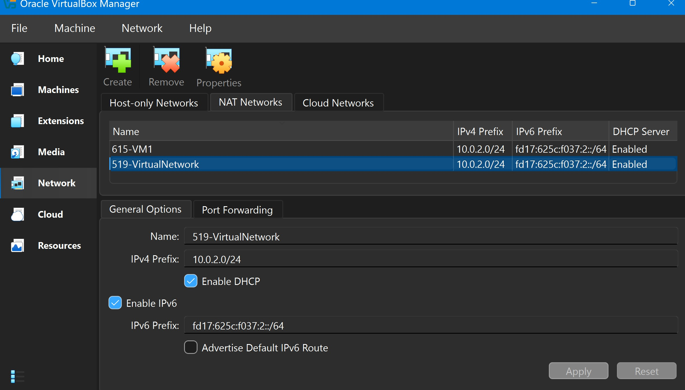
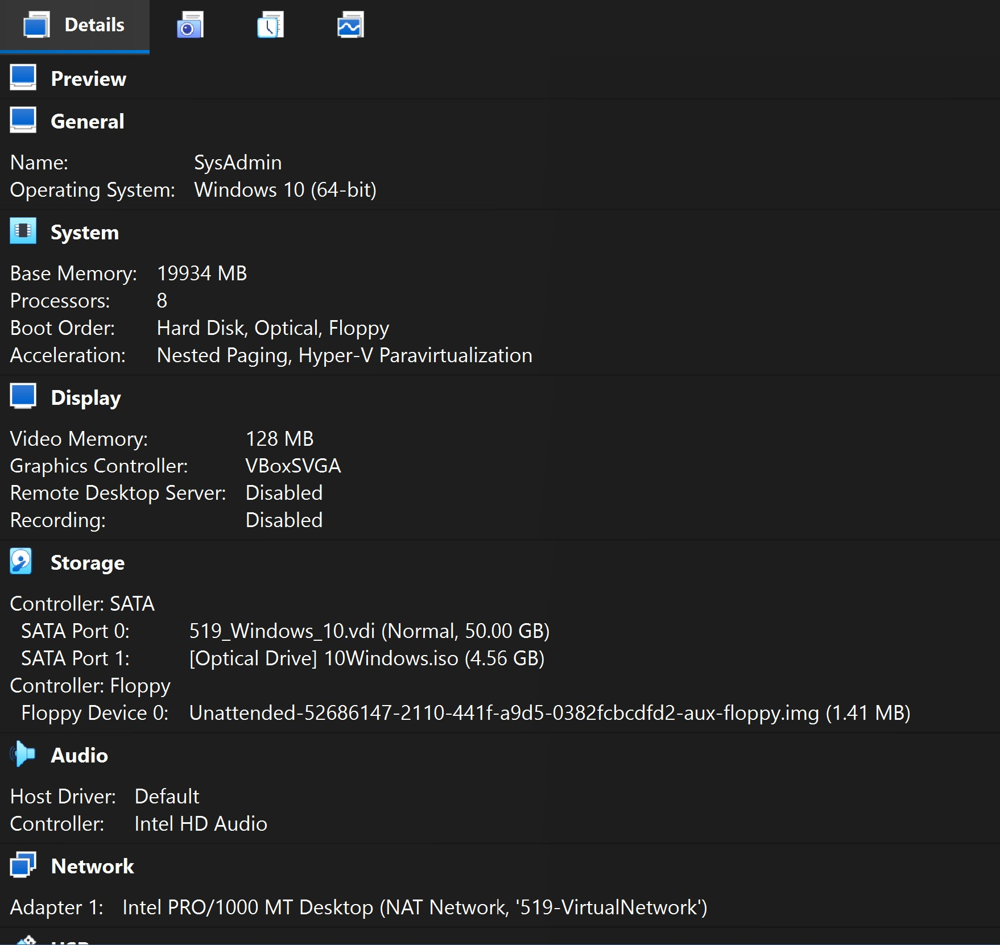
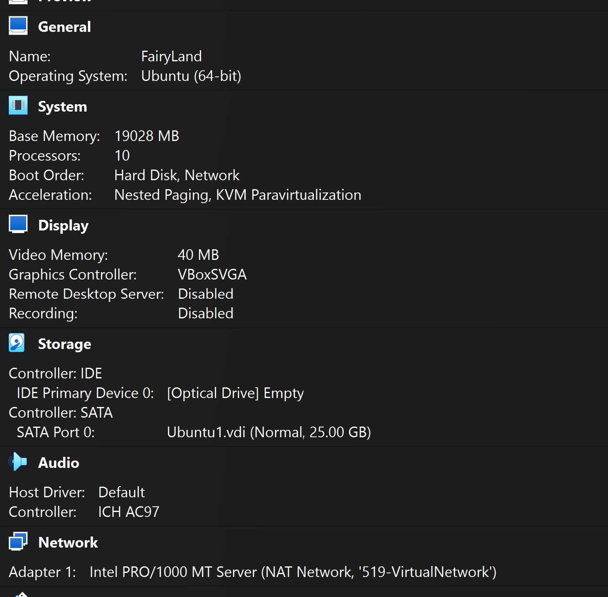
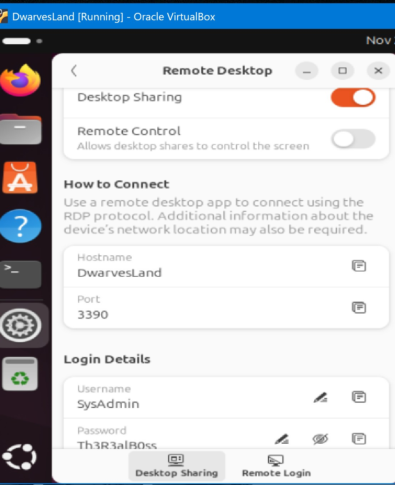
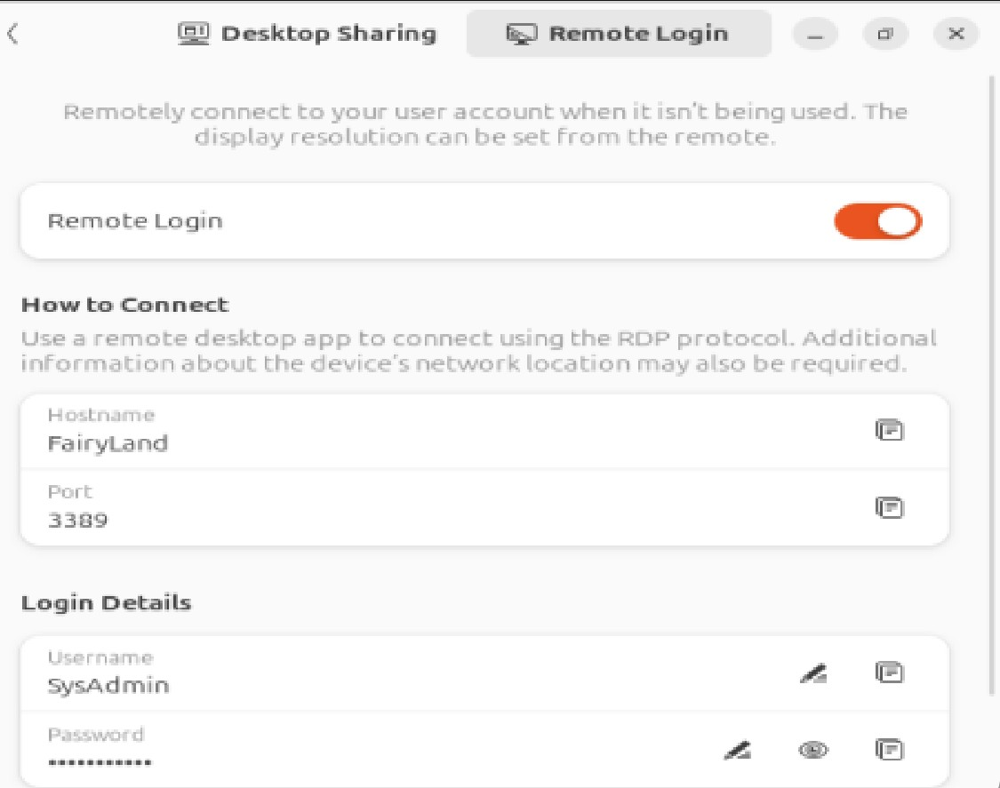
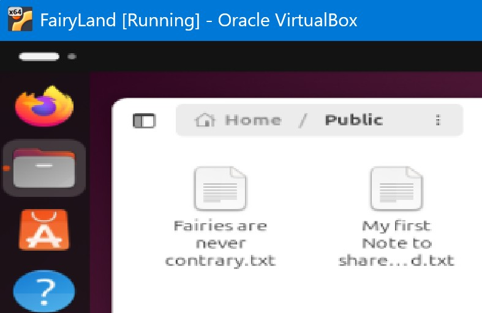
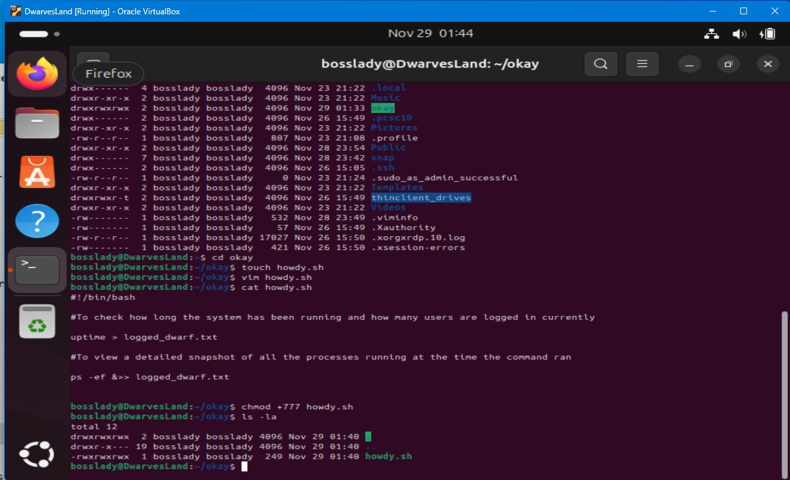
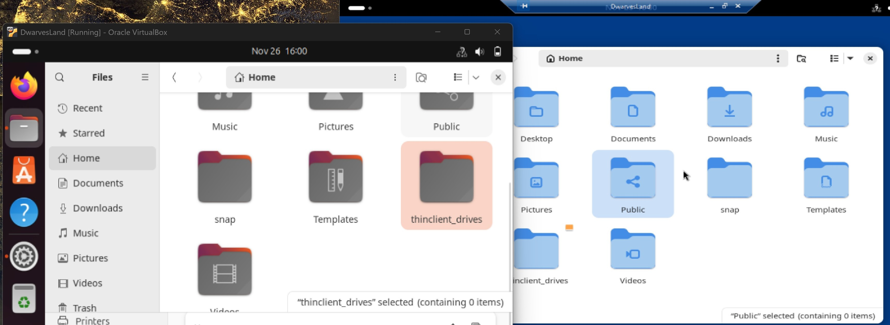
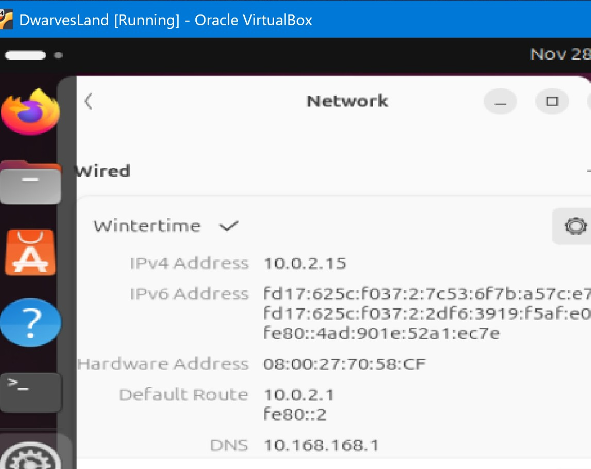

# Process Steps:
1. Install VirtualBox and create:  
  a.	Example   
  b.	Example   
  c.	Example   
  d.	Example   

## Note - complete steps 2 through 5 for both FairyLand VM and DwarvesLand VM, before proceeding to step 6.

2.	Got to settings, add users (Name, login, password):
  
| **Name**      | **Login**    | **Password**   |
| --------------|:------------:| :-------------:|
| Bob Smith     | bobsmith     | Employ111Us3r  | 
| Jane Wilson   | janewilson   | Employ222Us3r  |  
| Charity Rouge | charityrouge | Employ333Us3r  |  
| Boss Lady     | bosslady     | Charg3!!!Us3r _(only for DwarvesLand)_ | 
| Boss Kitty    | bosskitty    | Charg3!!!Us3r _(only for FairyLand)_ |

3. Under settings, set System Desktop Sharing details  
  a.  Example   
  b.  Example     
 	
4.	Install an app for creating locally two documents and save them in the Home/Public directory that will be accessible via the remote session; example 

5.	In Terminal, execute the below commands (if sudo does not initially work, then first use `$ sudo -i` to elevate permissions before proceeding to installs)
    
    a.	Install RDP:  
    `$	sudo apt update && sudo apt install xrdp`  
    `$	sudo systemctl enable xrdp`  
    `$	sudo systemctl start xrdp`  
  
     b.	Install Vim:  
    `$	sudo apt install vim`
   
     c. Create bash script and change execute permissions:      
  	   `$  mkdir okay`    
  	   `$  cd okay`    
  	   `$  touch howdy.sh`    
  	   `$  vim howdy.sh`  example      
  	   `$  chmod +777 okay`     
  	   `$  chmod +777 howdy.sh`         
  	   `$  ./howdy.sh`       	  

7.	On SysAdmin VM, go to "Windows Security", then "App & browser control > Exploit protection > Exploit protection settings. Find vmcompute.exe and vmwp.exe, click "Edit," and turn off the "Control flow guard (CFG)" setting for both.

8.	Next on SysAdmin VM, install WSL (this will allow PowerShell to execute the bash script for the remote machines), reference https://learn.microsoft.com/en-us/windows/wsl/install for steps.

9.	As administrator open PowerShell ISE and run commands:
   
    a. Establish remote connection:	 `$  mstsc /v:DwarvesLand:3390`
  	      or
  	    `$  New-PSSession -FairyLand -Crendential (Get-Crendential)`
  	
  	b. Enter credentials...      

  	c. Proceed in remote session 

10.   _Unsuccessful Last Steps_

   a. Example        
   
   b. Example     
  
12. _Theoretical Steps that should work_   

   a. Run commands in PowerShell:    
         ` $  New-PSSession` see https://learn.microsoft.com/en-us/powershell/module/microsoft.powershell.core/new-pssession?view=powershell-7.5 for guidance     
         ` $  Invoke-Command` see https://learn.microsoft.com/en-us/powershell/module/microsoft.powershell.core/invoke-command?view=powershell-7.5 for guidance   

    

  	  
  	
